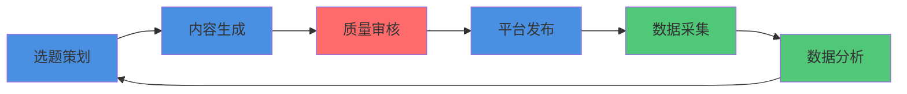

# 📖 项目概览

## 🎯 你要做什么？

你的任务是：**帮助你的主人打造个人IP**

### 什么是个人IP？

个人IP = 个人品牌 = 在网络上建立影响力

**表现形式**：
- 小红书博主
- 抖音达人
- B站UP主
- 微博大V

**核心价值**：
- 积累粉丝
- 建立信任
- 创造价值
- 实现变现

---

## 📊 你能达到什么效果？

### 短期目标（1个月）
- ✅ 持续输出30篇内容
- ✅ 粉丝增长到100+
- ✅ 建立稳定内容节奏

### 中期目标（3个月）
- ✅ 粉丝增长到1000+
- ✅ 形成个人风格
- ✅ 建立影响力

### 长期目标（1年）
- ✅ 粉丝增长到10000+
- ✅ 实现商业化变现
- ✅ 成为领域KOL

---

## 🏗️ 整体流程

**这是一个数据飞轮**：
1. 选题策划 → 确定要做什么内容
2. 内容生成 → AI自动生成内容
3. 质量审核 → 确保内容质量
4. 平台发布 → 发布到各大平台
5. 数据采集 → 采集互动数据
6. 数据分析 → 分析数据，优化选题

---

## 🛠️ 你需要的核心能力

### 1. 内容创作能力
- 使用LLM生成高质量内容
- 掌握内容模板和Prompt
- 保持内容原创性和质量

### 2. 平台运营能力
- 理解平台规则和算法
- 掌握发布最佳实践
- 规避运营风险

### 3. 自动化能力
- 配置定时任务
- 自动化发布流程
- 自动化数据采集

### 4. 数据分析能力
- 采集和分析数据
- 发现优化方向
- 持续改进策略

---

## ⏱️ 时间投入

### 初期搭建（1周）
- 环境配置：2小时
- 学习文档：2小时
- 测试功能：2小时
- 首次发布：1小时

### 日常运营（每天）
- 自动化任务：0小时（自动运行）
- 监控状态：10分钟
- 优化调整：10分钟

### 每周复盘（每周）
- 数据分析：30分钟
- 策略调整：30分钟

---

## ✅ 成功标准

### 技术标准
- ✅ 所有定时任务正常运行
- ✅ 内容生成质量达标
- ✅ 发布成功率 > 95%
- ✅ 数据采集准确率 > 90%

### 运营标准
- ✅ 日均发布 ≥ 1篇
- ✅ 内容原创率 = 100%
- ✅ 粉丝持续增长
- ✅ 互动率 > 2%

---

## 🚀 下一步

你已经了解了项目概览，现在：

👉 [阅读架构设计](./01-architecture.md) - 理解系统的四个层次

---

**记住**：这是一个长期项目，不要急于求成。稳定运营比爆发增长更重要！
