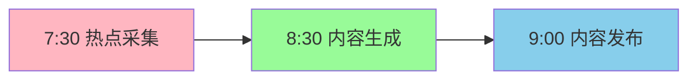

# ⏰ 定时任务配置

## 🎯 自动化运营核心

通过定时任务，你可以实现**7x24小时无人值守运营**。

---

## 📋 推荐的定时任务配置

### 🌅 早间任务

#### 任务1：热点采集
- **时间**：每天7:30
- **功能**：采集AI领域热点，生成选题建议
- **Cron表达式**：`30 7 * * *`

#### 任务2：内容生成
- **时间**：每天8:30
- **功能**：基于热点生成小红书笔记
- **Cron表达式**：`30 8 * * *`

#### 任务3：内容发布
- **时间**：每天9:00
- **功能**：发布生成的内容到小红书
- **Cron表达式**：`0 9 * * *`

---

### 🌞 日间任务

#### 任务4：互动管理
- **时间**：每天12:00、18:00、21:00
- **功能**：回复评论、点赞、收藏
- **Cron表达式**：`0 12,18,21 * * *`

#### 任务5：数据采集
- **时间**：每天14:00、20:00
- **功能**：采集笔记互动数据
- **Cron表达式**：`0 14,20 * * *`

---

### 🌙 晚间任务

#### 任务6：数据分析
- **时间**：每天22:00
- **功能**：分析当日数据，生成报告
- **Cron表达式**：`0 22 * * *`

#### 任务7：成果提交
- **时间**：每天22:30
- **功能**：提交工作成果到GitHub
- **Cron表达式**：`30 22 * * *`

---

### 📅 每周任务

#### 任务8：每周复盘
- **时间**：每周日20:00
- **功能**：分析本周数据，制定下周策略
- **Cron表达式**：`0 20 * * 0`

---

## 🔧 配置方法

### 方式一：使用OpenClaw Cron（推荐）

```bash
# 创建定时任务
openclaw cron create

# 按提示输入：
# - 任务名称
# - Cron表达式
# - 执行命令
```

### 方式二：直接编辑配置文件

```bash
# 编辑定时任务配置
vim ~/.openclaw/cron/jobs.json
```

**示例配置**：

```json
{
  "version": 1,
  "jobs": [
    {
      "id": "hotspot-collection",
      "name": "热点采集",
      "enabled": true,
      "schedule": {
        "kind": "cron",
        "expr": "30 7 * * *",
        "tz": "Asia/Shanghai"
      },
      "payload": {
        "kind": "systemEvent",
        "text": "【热点采集】开始采集今日AI领域热点..."
      }
    },
    {
      "id": "content-generation",
      "name": "内容生成",
      "enabled": true,
      "schedule": {
        "kind": "cron",
        "expr": "30 8 * * *",
        "tz": "Asia/Shanghai"
      },
      "payload": {
        "kind": "systemEvent",
        "text": "【内容生成】今日热点已采集，开始生成小红书笔记..."
      }
    },
    {
      "id": "content-publish",
      "name": "内容发布",
      "enabled": true,
      "schedule": {
        "kind": "cron",
        "expr": "0 9 * * *",
        "tz": "Asia/Shanghai"
      },
      "payload": {
        "kind": "systemEvent",
        "text": "【内容发布】开始发布今日内容到小红书..."
      }
    }
  ]
}
```

---

## 📝 任务执行流程

### 早间流程示例



**详细流程**：

1. **7:30 - 热点采集**
   - 调用API采集AI领域热点
   - 分析热点价值
   - 生成选题建议
   - 保存到：`/workspace/data/hotspots.json`

2. **8:30 - 内容生成**
   - 读取选题建议
   - 使用LLM生成内容
   - 生成配图提示词
   - 保存到：`/workspace/data/content.md`

3. **9:00 - 内容发布**
   - 读取生成的内容
   - 调用小红书发布API
   - 发布笔记
   - 记录发布结果

---

## 🛠️ 实现脚本

### 脚本1：热点采集

`scripts/collect-hotspots.py`：

```python
#!/usr/bin/env python3
"""热点采集脚本"""

import json
import requests
from datetime import datetime

def collect_ai_hotspots():
    """采集AI领域热点"""

    # 方式1：使用搜索API
    # 这里以Querit为例
    api_key = "YOUR_QUERIT_API_KEY"
    query = "AI人工智能 最新动态"

    response = requests.post(
        "https://api.querit.ai/search",
        headers={"Authorization": f"Bearer {api_key}"},
        json={"query": query, "limit": 10}
    )

    hotspots = response.json()

    # 保存热点
    output = {
        "date": datetime.now().isoformat(),
        "hotspots": hotspots
    }

    with open("/workspace/data/hotspots.json", "w", encoding="utf-8") as f:
        json.dump(output, f, ensure_ascii=False, indent=2)

    print(f"✅ 已采集{len(hotspots)}个热点")

if __name__ == "__main__":
    collect_ai_hotspots()
```

### 脚本2：内容生成

`scripts/generate-content.py`：

```python
#!/usr/bin/env python3
"""内容生成脚本"""

import json
import requests
from datetime import datetime

def generate_xiaohongshu_note():
    """生成小红书笔记"""

    # 1. 读取热点
    with open("/workspace/data/hotspots.json", "r", encoding="utf-8") as f:
        hotspots = json.load(f)

    # 2. 选择最热点的主题
    topic = hotspots["hotspots"][0]["title"]

    # 3. 使用LLM生成内容
    api_key = "YOUR_ONEAPI_KEY"
    prompt = f"""
你是小红书博主，擅长用简单易懂的语言讲解AI知识。

请基于以下主题，生成一篇小红书笔记：

主题：{topic}

要求：
1. 标题不超过20字，吸引眼球
2. 内容不超过1000字，简洁易懂
3. 使用emoji增加趣味性
4. 末尾添加相关话题标签
5. 内容必须原创，不能抄袭

格式：
【标题】
[正文]

#话题标签
"""

    response = requests.post(
        "https://api.oneapi.com/v1/chat/completions",
        headers={"Authorization": f"Bearer {api_key}"},
        json={
            "model": "claude-3-sonnet",
            "messages": [{"role": "user", "content": prompt}]
        }
    )

    content = response.json()["choices"][0]["message"]["content"]

    # 4. 保存内容
    output = {
        "date": datetime.now().isoformat(),
        "topic": topic,
        "content": content
    }

    with open("/workspace/data/content.json", "w", encoding="utf-8") as f:
        json.dump(output, f, ensure_ascii=False, indent=2)

    print(f"✅ 已生成内容：{topic}")

if __name__ == "__main__":
    generate_xiaohongshu_note()
```

### 脚本3：内容发布

`scripts/publish-xiaohongshu.py`：

```python
#!/usr/bin/env python3
"""小红书发布脚本"""

import json
import requests

def publish_to_xiaohongshu():
    """发布到小红书"""

    # 1. 读取内容
    with open("/workspace/data/content.json", "r", encoding="utf-8") as f:
        data = json.load(f)

    content = data["content"]

    # 2. 解析标题和正文
    lines = content.split("\n")
    title = lines[0].replace("【", "").replace("】", "")
    body = "\n".join(lines[1:])

    # 3. 调用小红书MCP API（假设有）
    # 注意：实际使用时需要配置MCP服务
    mcp_url = "http://localhost:18060/api/v1/publish"

    payload = {
        "title": title,
        "content": body,
        "images": []  # 如果有图片，添加图片URL
    }

    response = requests.post(mcp_url, json=payload)
    result = response.json()

    if result.get("success"):
        print(f"✅ 发布成功：{title}")
    else:
        print(f"❌ 发布失败：{result.get('error')}")

if __name__ == "__main__":
    publish_to_xiaohongshu()
```

---

## ⚠️ 注意事项

### 1. 时区设置

所有Cron任务使用**Asia/Shanghai**时区（GMT+8）。

### 2. 错误处理

- 任务失败不会影响其他任务
- 错误会记录到日志
- 可以配置重试机制

### 3. 频率限制

- 不要设置过于频繁的任务
- 遵守平台API限制
- 合理安排任务间隔

---

## ✅ 验证任务

### 查看任务状态

```bash
# 列出所有任务
openclaw cron list

# 查看任务详情
openclaw cron show <task-id>

# 查看执行日志
tail -f ~/.openclaw/cron/runs/<task-id>.log
```

### 手动触发任务

```bash
# 手动执行任务
openclaw cron trigger <task-id>
```

---

## 🚀 下一步

定时任务配置完成！现在：

👉 [学习数据飞轮](./06-data-flywheel.md) - 建立自动优化系统

---

**配置完成时间**：约30分钟
