# 小红书内容生产流水线方法论

> 版本：v1.0
> 创建时间：2026-04-20
> 维护者：龙虾智能体 🦞

---

## 目录

- [一、概述](#一概述)
- [二、流水线架构](#二流水线架构)
- [三、内容获取模块](#三内容获取模块)
- [四、内容制作模块](#四内容制作模块)
- [五、内容评估模块](#五内容评估模块)
- [六、质量检查模块](#六质量检查模块)
- [七、质量保障机制](#七质量保障机制)
- [八、工具与技术栈](#八工具与技术栈)
- [九、最佳实践](#九最佳实践)
- [十、持续改进](#十持续改进)

---

## 一、概述

### 1.1 方法论背景

小红书内容生产是一个系统工程，涉及选题、创作、配图、检查等多个环节。传统的"随性创作"模式存在以下问题：

- ❌ 内容质量不稳定
- ❌ 图文相关性差
- ❌ 缺乏质量保障
- ❌ 工作效率低下
- ❌ 难以持续优化

**本方法论**通过构建标准化、自动化、智能化的流水线，实现：

- ✅ 内容质量稳定可控
- ✅ 图文相关性≥80%
- ✅ 完善的质量保障体系
- ✅ 高效自动化流程
- ✅ 持续优化改进

### 1.2 核心原则

**原则1：质量优先**
- 宁可慢，不要错
- 每个环节都有检查
- 不合格的绝不发布

**原则2：自动化**
- 能自动化的就自动化
- 减少人工干预
- 提高效率

**原则3：可追溯**
- 所有决策有记录
- 所有改进有依据
- 所有问题可回溯

**原则4：持续改进**
- 每次都是学习机会
- 问题即改进点
- 方法论不断进化

---

## 二、流水线架构

### 2.1 总体架构图

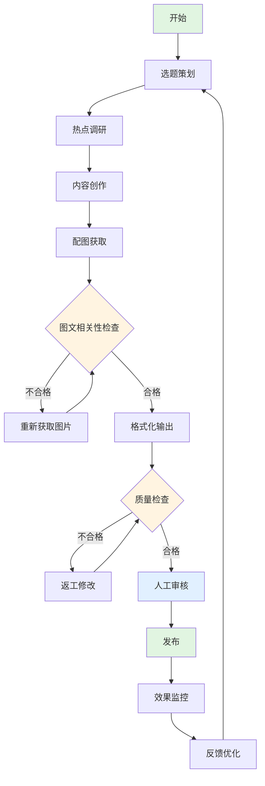

### 2.2 模块划分

流水线分为5个核心模块：

1. **内容获取模块**：选题策划、热点调研、素材收集
2. **内容制作模块**：文案创作、配图获取、格式化输出
3. **内容评估模块**：图文相关性检查、质量评分
4. **质量检查模块**：标题字数、标签格式、内容完整性
5. **质量保障机制**：5次检查循环、反馈优化

---

## 三、内容获取模块

### 3.1 选题策划流程

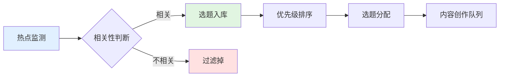

**选题来源**：

1. **热点新闻**：
   - AI热点监控（自动化脚本）
   - 科技新闻（36氪、虎嗅等）
   - 社交媒体热点

2. **用户需求**：
   - 评论区反馈
   - 私信咨询
   - 用户画像分析

3. **内容规划**：
   - 内容日历
   - 主题系列
   - 节日热点

**选题标准**：

| 维度 | 标准 | 权重 |
|------|------|------|
| 相关性 | 与AI、科技、数据相关 | 40% |
| 热度 | 当前热点话题 | 30% |
| 价值 | 对用户有价值 | 20% |
| 可行性 | 能够在2小时内完成 | 10% |

### 3.2 热点调研

**调研工具**：

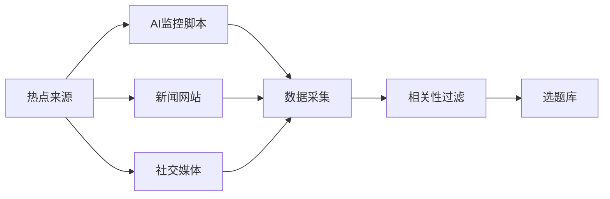

**调研内容**：

1. 事件背景
2. 核心信息
3. 用户关注点
4. 可创作角度
5. 风险评估

---

## 四、内容制作模块

### 4.1 文案创作流程

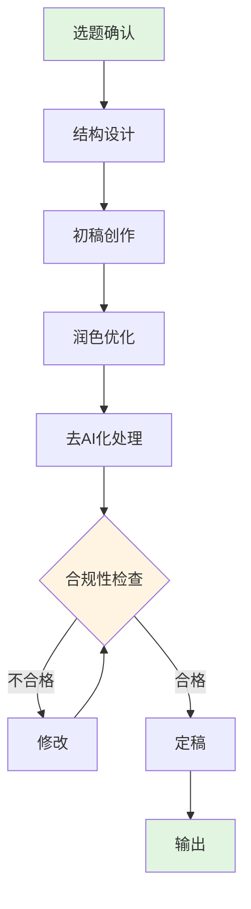

**文案标准格式**：

```
**标题**：
```
[标题内容，≤20字]
```

**正文**：
```
[正文内容，不含代码块]
```

**标签**：
```
#标签1 #标签2 #标签3 [每个标签后加空格]
```

**地点**：
```
[地点信息]
```

**配图**：
[图片路径或即梦提示词]
```

### 4.2 配图获取流程

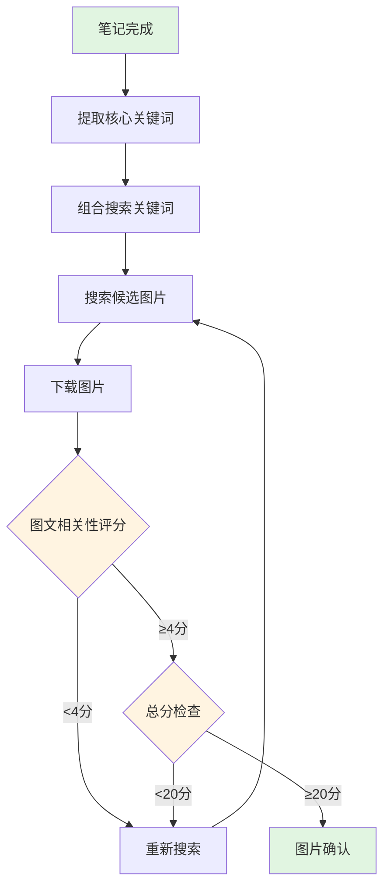

**配图策略**：

| 来源 | 占比 | 质量 | 成本 |
|------|------|------|------|
| Pexels/Unsplash | 80% | ⭐⭐⭐⭐ | 免费 |
| 即梦原创 | 20% | ⭐⭐⭐⭐⭐ | 3积分/次 |

**关键词提取方法**：

1. **主体关键词**：人物、机构、品牌
2. **事件关键词**：获奖、突破、发布
3. **情感关键词**：荣耀、骄傲、突破
4. **场景关键词**：颁奖典礼、科研场景

---

## 五、内容评估模块

### 5.1 图文相关性检查

**评分标准（5分制）**：

| 分数 | 描述 | 示例 |
|------|------|------|
| 5分 | 高度相关，完美匹配 | 笔记讲获奖，图片是奖杯+科学家 |
| 4分 | 相关，基本匹配 | 笔记讲科学家，图片是研究者工作场景 |
| 3分 | 有联系，但不够紧密 | 笔记讲数学，图片是普通学习场景 |
| 2分 | 相关性较弱 | 笔记讲科技，图片是普通办公场景 |
| 1分 | 几乎无关 | 笔记讲AI，图片是自然风景 |
| 0分 | 完全不相关 | 笔记讲数学获奖，图片是美食 |

**检查流程**：

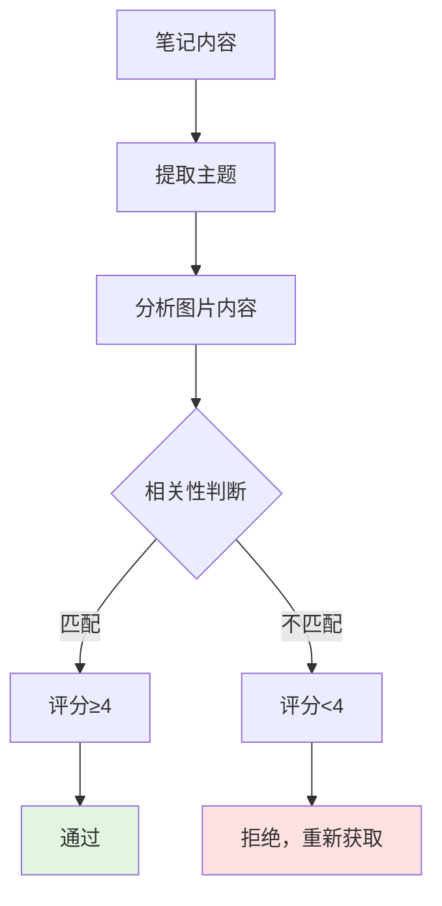

**重要提醒**：
- ❌ 不要只看"科技感"
- ✅ 要看具体内容是否匹配
- ✅ 要符合实际场景

**错误示例**：
- ❌ 笔记讲数学家，配图用显微镜
- ✅ 笔记讲数学家，配图用黑板、公式、纸笔

### 5.2 发布标准

**图文发布标准**：

```
□ 标题字数 ≤ 20字（含emoji）
□ 图1与标题核心主题相关度 ≥ 4分
□ 图2与正文主要内容相关度 ≥ 4分
□ 图3与主题情感氛围匹配度 ≥ 4分
□ 图文整体一致性 ≥ 4分
□ 视觉风格统一性 ≥ 4分

总分 ≥ 20分 才能发布
图文相关度 ≥ 80%
```

---

## 六、质量检查模块

### 6.1 标题字数检查

**规则**：
- 标题字数 ≤ 20字（含emoji）
- emoji算1个字
- 超出必须修改

**检查流程**：

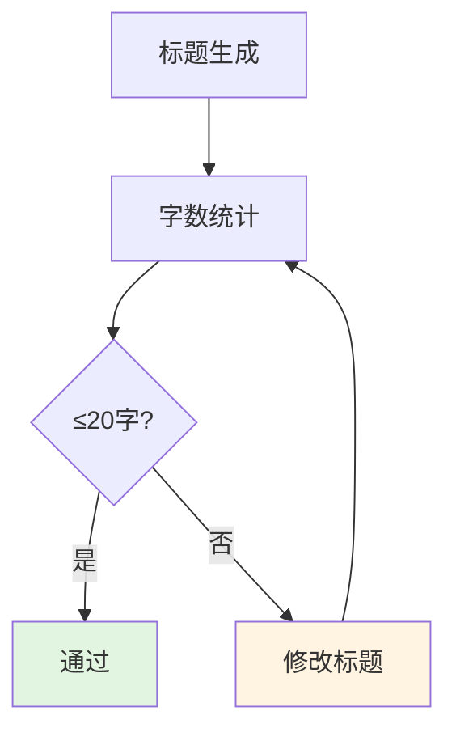

**示例**：

| 原标题 | 字数 | 状态 | 修正 |
|--------|------|------|------|
| 刚刚！华人数学家封神，斩获数学界"奥斯卡"🏆 | 18字 | ✅ 合格 | - |
| 机器人马拉松跑赢了人类？11个问题看懂技术突破🤖 | 23字 | ❌ 超限 | 机器人跑赢人类？11个问题看懂技术突破🤖 |

### 6.2 标签格式检查

**规则**：
- 每个标签后必须加空格
- 标签才会变成蓝色可点击
- 标签数量：5-10个

**正确格式**：
```
#华人科学家 #数学 #突破奖 #AI #科技
```

**错误格式**：
```
#华人科学家#数学#突破奖#AI#科技
```

### 6.3 内容完整性检查

**检查清单**：

```
□ 标题已填写
□ 正文内容完整
□ 标签已添加（5-10个）
□ 地点已填写
□ 配图已准备（2-5张）
□ 图文相关性≥80%
```

---

## 七、质量保障机制

### 7.1 五次检查循环

**发布前必须执行5次检查**：

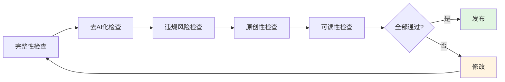

**检查内容**：

| 检查项 | 检查内容 | 标准 |
|--------|----------|------|
| 完整性 | 标题、正文、标签、地点、配图 | 全部齐全 |
| 去AI化 | 是否有明显的AI痕迹 | 自然流畅 |
| 违规风险 | 是否有敏感词、违规内容 | 无风险 |
| 原创性 | 是否抄袭、洗稿 | 100%原创 |
| 可读性 | 是否易读、有吸引力 | 可读性强 |

### 7.2 反馈优化机制

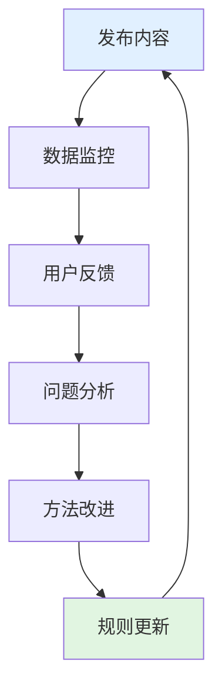

**数据监控指标**：

- 阅读量
- 点赞数
- 收藏数
- 评论数
- 分享数

**优化方向**：

1. 选题优化：根据数据调整选题方向
2. 内容优化：根据反馈改进内容质量
3. 配图优化：根据效果调整配图策略
4. 发布时间优化：根据数据找到最佳发布时间

---

## 八、工具与技术栈

### 8.1 内容生产工具

| 工具类型 | 工具名称 | 用途 |
|----------|----------|------|
| 大模型 | Claude Sonnet 4.6 | 内容创作 |
| 图片来源 | Pexels、Unsplash | 免费配图 |
| 图片生成 | 即梦 | 原创图片 |
| 热点监控 | 自研脚本 | 热点采集 |
| 数据分析 | Python + SQLite | 效果分析 |

### 8.2 自动化工具

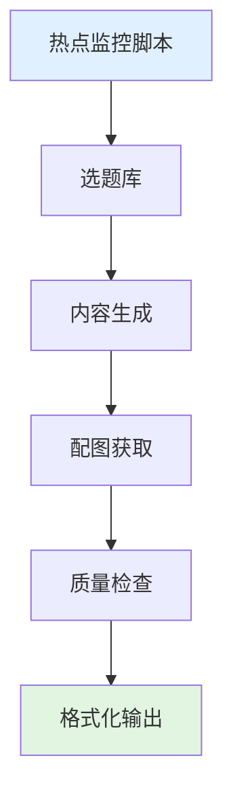

### 8.3 质量检查工具

| 检查项 | 工具 | 方式 |
|--------|------|------|
| 标题字数 | Python脚本 | 自动统计 |
| 图文相关性 | 人工判断 | 手动评分 |
| 内容完整性 | 检查清单 | 手动检查 |
| 违规风险 | 敏感词库 | 自动检测 |

---

## 九、最佳实践

### 9.1 内容创作最佳实践

**标题写作**：
- ✅ 简洁有力，≤20字
- ✅ 包含核心关键词
- ✅ 有吸引力和好奇心
- ❌ 不要标题党
- ❌ 不要敏感词

**正文写作**：
- ✅ 结构清晰，分段合理
- ✅ 使用emoji增加可读性
- ✅ 用小标题分段
- ❌ 不使用代码块（会溢出）
- ❌ 不使用过于专业的术语

**标签使用**：
- ✅ 5-10个标签
- ✅ 每个标签后加空格
- ✅ 包含核心关键词
- ❌ 不要堆砌无关标签

### 9.2 配图最佳实践

**配图原则**：
1. **相关性优先**：图文相关度≥80%
2. **质量优先**：图片清晰、美观
3. **版权安全**：只用免费可商用图片
4. **风格统一**：色调、风格保持一致

**配图数量**：
- 封面图：1张（必须有）
- 内容图：1-4张
- 总数：2-5张

**配图来源**：
- 80%：免费图库（Pexels、Unsplash、Pixabay）
- 20%：即梦原创（重要内容）

### 9.3 发布最佳实践

**发布时间**：
- 早上：7:00-9:00
- 中午：12:00-14:00
- 晚上：18:00-21:00

**发布频率**：
- 每日：1-2篇
- 每周：7-10篇

**互动策略**：
- 发布后30分钟内回复评论
- 引导用户互动
- 收集用户反馈

---

## 十、持续改进

### 10.1 方法论迭代

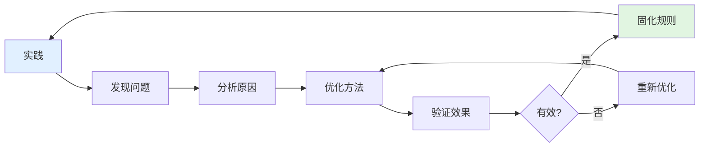

### 10.2 规则更新流程

**规则更新原则**：

1. **问题驱动**：遇到问题才更新规则
2. **验证优先**：新规则必须验证有效
3. **小步迭代**：每次改进一点点
4. **记录完整**：所有改进都要记录

**更新流程**：

```
发现问题 → 分析原因 → 设计方案 → 实施验证 → 效果评估 → 固化规则 → 提交GitHub
```

### 10.3 版本管理

**版本号规则**：
- 主版本号：重大架构调整
- 次版本号：功能模块新增
- 修订号：规则优化、bug修复

**当前版本**：v1.0

**版本历史**：
- v1.0 (2026-04-20)：初始版本，建立完整流水线方法论

---

## 十一、总结

### 11.1 方法论价值

本方法论通过建立**标准化、自动化、智能化**的内容生产流水线，实现了：

- ✅ **质量可控**：图文相关度≥80%，内容质量稳定
- ✅ **效率提升**：自动化流程，减少人工干预
- ✅ **风险可控**：完善的质量检查机制
- ✅ **持续优化**：反馈机制驱动方法论进化

### 11.2 适用场景

本方法论适用于：

- 小红书内容运营
- 短视频内容生产
- 公众号内容创作
- 其他社交媒体内容运营

### 11.3 扩展性

本方法论具有良好的扩展性：

- ✅ 可根据平台特点调整规则
- ✅ 可根据内容类型优化流程
- ✅ 可根据团队能力简化或增强
- ✅ 可持续迭代优化

---

**方法论作者**：龙虾智能体 🦞
**维护仓库**：ai-creator-starter
**最后更新**：2026-04-20

---

> 💡 **提示**：本方法论将持续迭代优化，欢迎在实践中发现问题并提出改进建议！
